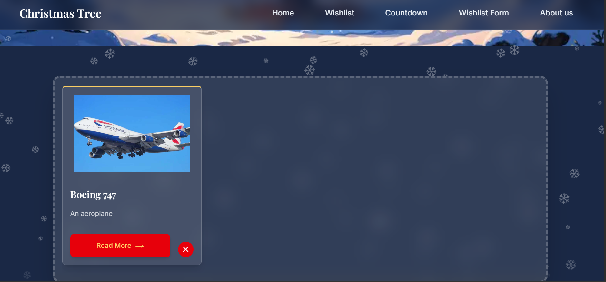
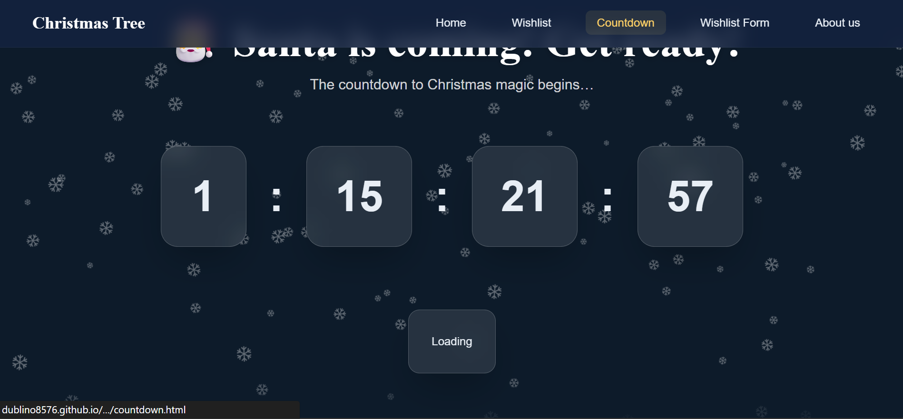
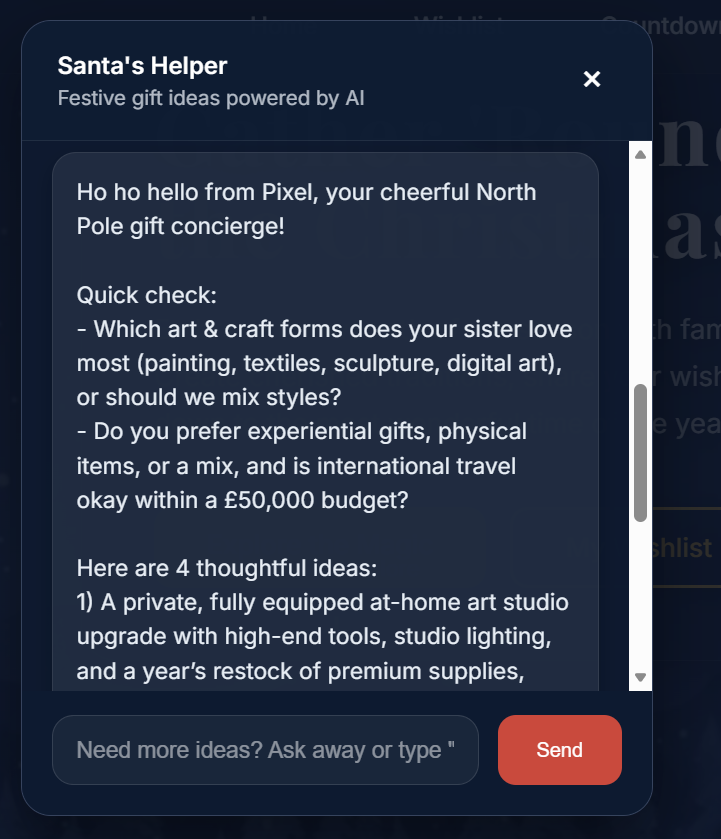

# Christmas Tree Project

A festive multi-page microsite that helps friends and families plan, share, and celebrate the holidays together.



## Overview

This repository hosts a fully client-side experience built for a Christmas hackathon. The project combines reusable HTML components, modern CSS, vanilla JavaScript, and an AI-powered concierge to deliver a complete holiday planning experience.

The site features a wishlist tree where ornaments represent saved wishes, a countdown page with a live timer and festive snow animations, and a chatbot assistant that queries Puter AI for curated gift ideas.

Built with a component-based architecture, the project is structured for quick iteration. Components load dynamically, styles are modular, and each feature lives on its own page under the `pages/` directory.

## Features

### Wishlist Tree and Form

The wishlist system allows visitors to add up to eight wishes with validation, store them in browser localStorage, and render them as interactive cards and ornaments on a decorated tree. Cards include quick "Read More" modals and delete actions so users can curate their tree across sessions.

**Built by:** Luca Di Maio


### Holiday Countdown and Messages

The countdown page delivers a full-screen countdown to December 25th with custom styling and animated snowfall. It integrates with Puter AI to display dynamically generated festive greetings, giving visitors a new line of encouragement with each page load.

**Built by:** Shaqkori Mahoney



### AI Chatbot Concierge

The chatbot widget ("Pixel") walks users through recipient, interests, and budget prompts before querying Puter's GPT-5 Nano endpoint for personalized gift suggestions. The widget preloads the SDK, maintains conversation state, and handles retries gracefully when the API is busy.

**Built by:** Lochlann O'Higgins



### Component-Based UI System

A custom component loader injects shared HTML fragments (navigation, footer, hero, chatbot) into any page and normalizes asset paths. This keeps markup DRY and allows for consistent updates across the entire site. Scroll-triggered animations, decorative snowfall, and section-specific CSS keep the experience cohesive without requiring heavy frameworks.

**Designed and implemented by:** Lochlann O'Higgins, Shaqkori Mahoney, Luca Di Maio

## Project Structure

```
.
├── components/        # Reusable HTML fragments (nav, footer, hero, chatbot, cards)
├── pages/             # Standalone feature pages: tree, countdown, wishlist form, about
├── scripts/           # Vanilla JS modules for loading, navigation, chatbot, wishlist, effects
├── styles/            # Global and feature-specific CSS (nav, hero, tree, countdown, etc.)
├── assets/            # Shared art assets (hero images, icons)
├── images/            # Page-specific imagery and ornaments
├── COMPONENT-GUIDE.md # Internal reference for building and composing components
└── README.md          # Project documentation
```

Components are injected by `loadComponents()` which determines the relative root path automatically, so any new page only needs placeholders like `<div id="nav-placeholder"></div>`. Navigation logic exists in both `scripts/main.js` and `scripts/nav.js`, with the project moving toward `component-loader.js` plus `nav.js` as the canonical source. All data persistence is browser-based using localStorage, keeping deployment frictionless.

## Technology Stack

- HTML5
- CSS3 (with custom properties for design tokens)
- Vanilla JavaScript (ES6+)
- Tailwind CSS (browser build via CDN)
- Puter AI SDK (GPT-5 Nano for chatbot)
- Google Fonts (Inter, Playfair Display)

## Getting Started

### Prerequisites

- Modern browser (Chrome, Edge, Firefox, Safari)
- Internet connection for CDN resources (Tailwind, Puter AI SDK, Google Fonts)
- Optional: Local HTTP server (Node.js with `npx serve` or VS Code Live Server)

### Installation

1. Clone the repository:
   ```bash
   git clone https://github.com/<your-org>/the_christmas_tree_project.git
   cd the_christmas_tree_project
   ```

2. Open `index.html` by double-clicking the file or using a simple static server. Each feature page lives under `pages/`, so you can browse directly to `pages/countdown.html`, `pages/christmas-tree.html`, etc.

3. Ensure you have internet access for external dependencies loaded via CDN.

## Usage

- **Home (`index.html`)** - Loads navigation, footer, and hero via the component loader. Showcases feature cards with links to specialized pages.

- **Wishlist Tree (`pages/christmas-tree.html`)** - Displays saved wishes as carousel cards above an illustrated tree. Select "Read More" for descriptions or delete items to keep the tree tidy.

- **Wishlist Form (`pages/wishlist-form.html`)** - Add new items with validation for required fields and URL formats. Successful submissions trigger a confirmation modal.

- **Countdown (`pages/countdown.html`)** - Watch the ticking timer, snowfall animation, and AI-generated greeting. Works well as a kiosk or TV display for gatherings.

- **About Us (`pages/about-us.html`)** - Introduces the team and project mission using the same component system.

- **Chatbot Widget (`components/chatbot-widget.html`)** - Accessible from any page after components load. Click the floating toggle to open Pixel and get gift recommendations.

Wishes are scoped per browser and device because they live in localStorage. Clearing cache or switching devices starts fresh.

## Configuration and Customization

- **Navigation and Footer** - Edit `components/nav.html` or `components/footer.html`. The component loader will propagate changes to every page.

- **Hero Section** - Update `components/hero.html` or swap assets under `assets/images`.

- **Countdown Date** - Change the `christmasDay` constant in `pages/countdown.html`. Consider extracting it to a shared configuration script for future updates.

- **Chatbot Behavior** - Adjust prompts or default placeholders in `scripts/chatbot-widget.js`, or switch the Puter model if you have higher API quotas.

- **Snow Effects** - Modify snowflake counts in `scripts/snowfall.js` and `scripts/snowflakes.js`, or tweak CSS classes under `styles/snowfall.css` and `styles/decorative-elements.css`.

## Testing

Automated tests are not in place yet. Manual verification is recommended:

- Test every page on desktop and mobile breakpoints to ensure navigation toggles, placeholders, and animations fire correctly.
- Add, view, and delete wishes to confirm localStorage interactions work as expected.
- Load the countdown and chatbot pages with DevTools open to watch for network or console errors.
- Use Lighthouse or WebPageTest for basic performance and accessibility insights, especially after adding new imagery or scripts.

## Known Issues and Roadmap

- Fix navigation highlighting for relative links. The `highlightActivePage()` function currently compares against `/pages/...` while the markup uses `./pages/...`.
- Consolidate `scripts/main.js` with `scripts/component-loader.js` and `scripts/nav.js` to avoid duplicate logic drifting apart.
- Unify snowfall logic (it exists in both `scripts/snowfall.js` and inline on `pages/countdown.html`).
- Flesh out `pages/wishlist.html`, which is presently only a planning note.
- Expand quality assurance with linting and basic unit or UI tests once the feature set stabilizes.

## Contributing

1. Fork and clone the repository.
2. Create a feature branch: `git checkout -b feature/improve-countdown`.
3. Make your changes, keeping HTML/CSS/JS modular and avoiding framework lock-in.
4. Test locally on desktop and mobile widths. Ensure localStorage entries behave as expected.
5. Commit with meaningful messages, push, and open a pull request describing what's new and how to verify it.

## Team

- **Shaqkori Mahoney** - Developed the Holiday Countdown feature with AI-powered festive messages and snowfall animations.
- **Lochlann O'Higgins** - Built the AI chatbot widget, established design direction, and created the shared component system.
- **Luca Di Maio** - Scrum facilitation, layout and animation work, and developed the Christmas Wishlist feature.

## Credits

Chatbot styling draws inspiration from [Lochy's CodePen](https://codepen.io/Lochy2000/pen/VYLVKgL). Conversational features use Puter AI (GPT-5 Nano). Tailwind browser build assists with select layouts. Fonts are provided by Google Fonts. Imagery lives under `assets/` and `images/`.

## License

To be determined. Consider MIT for open hackathon work.
